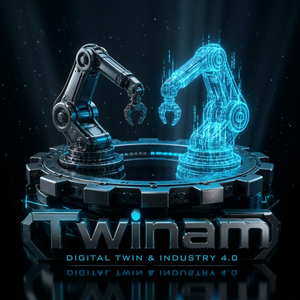
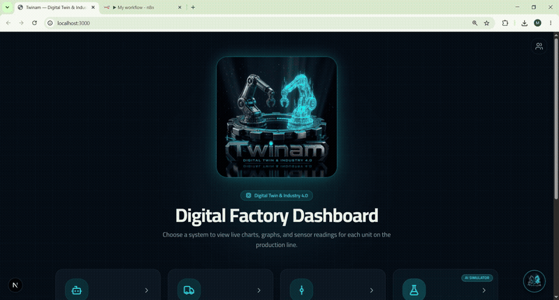
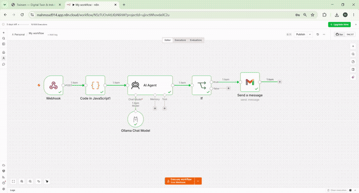
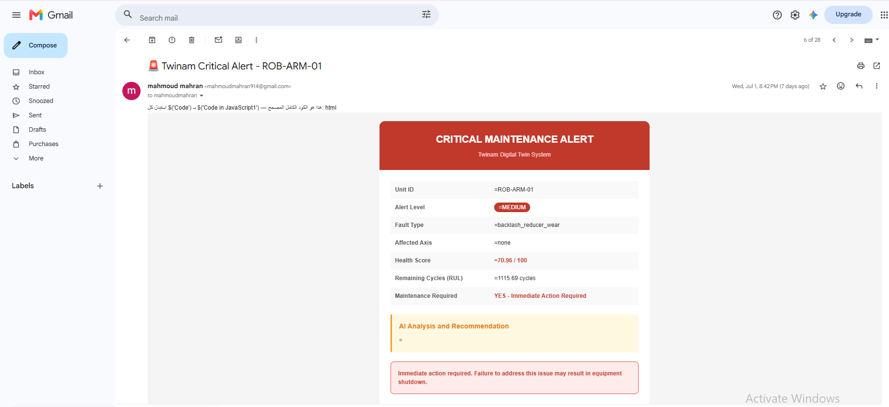
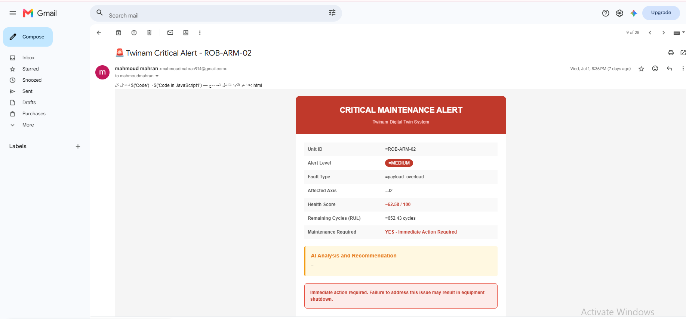
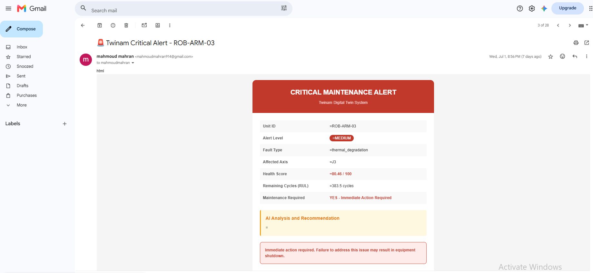

<div align="center">



# Twinam — Smart Factory Digital Twin

### AI-Powered Predictive Maintenance Platform for Industrial Robot Arms

[](https://fastapi.tiangolo.com)
[](https://nextjs.org)
[](https://python.org)
[](https://tensorflow.org)
[](https://xgboost.readthedocs.io)
[](https://mqtt.org)
[](https://n8n.io)
[](LICENSE)

**A full-stack Smart Factory Digital Twin that connects real industrial PLC hardware to an AI-powered dashboard — enabling real-time predictive maintenance, fault detection, and automated intelligent alerts.**

[📖 Documentation](#architecture) · [⚙️ Installation](#installation) · [📡 API Reference](#api-reference) · [👥 Team](#team)

---



</div>

---

## 📋 Table of Contents

- [Overview](#overview)
- [Key Features](#key-features)
- [AI Models](#ai-models)
- [Tech Stack](#tech-stack)
- [Architecture](#architecture)
- [Project Structure](#project-structure)
- [Installation](#installation)
- [API Reference](#api-reference)
- [N8N Automation](#n8n-automation)
- [Dashboard Views](#dashboard-views)
- [Team](#team)
- [Contact](#contact)

---

## 🏭 Overview

**Twinam** is a production-ready **Smart Factory Digital Twin** platform for real-time monitoring and predictive maintenance of **6-axis industrial robot arms**. It bridges physical hardware — via **OPC UA**, **PLC**, and **Siemens TIA Portal** — with an intelligent AI dashboard that predicts faults before they happen, estimates remaining useful life, and triggers automated maintenance workflows.

> Developed as part of the **NTI HireReady Digital Twin Engineering Program** — demonstrating a complete **Industry 4.0** stack from embedded sensors to cloud AI automation.

---

## ✨ Key Features

| Feature | Description |
|---|---|
| 🤖 **5 AI Predictive Models** | LSTM for RUL & Health Score · 3 XGBoost classifiers for fault detection |
| 📡 **Real-time MQTT Pipeline** | Live sensor data from robot arms via MQTT broker |
| 🏭 **PLC / OPC UA Integration** | Siemens TIA Portal + Ladder Diagram + OPC UA protocol |
| 📊 **Live Dashboard** | Next.js interactive dashboard with real-time charts |
| 🧪 **Scenario Simulator** | 53-feature sliders to simulate any sensor condition |
| 🤖 **AI Chatbot Assistant** | On-premise Ollama LLM for maintenance recommendations |
| 🔄 **N8N AI Automation** | Automated AI analysis and email alerts on fault detection |
| ⚠️ **Shutdown Warnings** | Predictive time-to-failure estimation with visual alerts |
| 👁️ **Multi-Unit Monitoring** | 3 Robot Arms + 2 Conveyors + AGV simultaneously |
| 🌙 **Dark / Light Theme** | Professional UI with full theme switching |

---

## 🧠 AI Models

The system uses **5 machine learning models** trained on real industrial sensor data with **53 sensor features**:

```
POST /predict_all  ←  53 sensor features  →  5 simultaneous predictions
```

| Model | Type | Task | Output |
|---|---|---|---|
| `main_lstm_rul_model` | **LSTM** Deep Learning | Remaining Useful Life | `RUL_cycles` (float) |
| `main_xgb_health_model` | **XGBoost** | Overall health score | `health_score` (0–100) |
| `main_fault_type_model` | **XGBoost** Classifier | Fault type detection | 7 fault classes |
| `main_fault_axis_model` | **XGBoost** Classifier | Affected joint detection | J1–J6 or none |
| `main_maintenance_model` | **XGBoost** Classifier | Maintenance urgency | 0 or 1 |

### 🔴 Fault Types Detected

| Class | Description | Trigger Signals |
|---|---|---|
| `normal` | Normal operation | All readings within range |
| `bearing_vibration` | Abnormal bearing wear | High `synthetic_vibration_j*_g` |
| `joint_friction` | Excessive joint friction | High `joint_*_effort_nm` |
| `collision_event` | Sudden impact | Sharp spike in `joint_*_acc_deg_s2` |
| `payload_overload` | Max payload exceeded | High `payload_mass_kg` + torque |
| `thermal_degradation` | Overheating | Rising `synthetic_temp_j*_c` |
| `backlash_reducer_wear` | Gearbox wear | Increasing `tracking_error_*_deg` |

### 📊 Alert Levels

| Level | Condition | Action |
|---|---|---|
| ✅ **OK** | Health ≥ 75, normal | No action needed |
| 🟡 **LOW** | Health 50–75 | Monitor closely |
| 🟠 **MEDIUM** | Fault present, RUL ≥ 100 | Schedule maintenance |
| 🔴 **HIGH** | Health < 50, RUL ≥ 50 | Urgent maintenance |
| 🚨 **CRITICAL** | Health < 25 or RUL < 50 | Immediate shutdown risk |

---

## 🛠️ Tech Stack

### Backend


### Frontend


### Industrial


### Automation & AI


---

## 🏗️ Architecture

```
┌──────────────────────────────────────────────────────────────┐
│                     PHYSICAL LAYER                            │
│   6-Axis Robot Arms ── PLC (TIA Portal) ── OPC UA Protocol   │
└─────────────────────────────┬────────────────────────────────┘
                              │ MQTT
┌─────────────────────────────▼────────────────────────────────┐
│                   BACKEND (FastAPI)                           │
│                                                               │
│  ┌────────────┐  ┌─────────────────┐  ┌──────────────────┐  │
│  │ LSTM Model │  │  XGBoost × 3    │  │  /predict_all    │  │
│  │ RUL        │  │  Fault Type     │  │  POST 53 feat.   │  │
│  │ Health     │  │  Fault Axis     │  │  → 5 predictions │  │
│  └────────────┘  │  Maintenance    │  └──────────────────┘  │
│                  └─────────────────┘                          │
└─────────────────────────────┬────────────────────────────────┘
                              │
          ┌───────────────────┴──────────────────┐
          ▼                                       ▼
┌──────────────────────┐            ┌─────────────────────────┐
│  Next.js Dashboard   │            │    N8N Cloud Automation  │
│                      │            │                          │
│  • Live Charts       │            │  MQTT Trigger            │
│  • Sensor Readings   │            │       ↓                  │
│  • Fault Alerts      │            │  Map 53 Features         │
│  • Scenario Sim.     │            │       ↓                  │
│  • AI Chatbot        │            │  FastAPI /predict_all    │
│  • Shutdown Warning  │            │       ↓                  │
└──────────────────────┘            │  Ollama LLM Analysis     │
                                    │       ↓                  │
                                    │  Email Alert (CRITICAL)  │
                                    └──────────────────────────┘
```

---

## 📁 Project Structure

```
twinam/
├── backend/
│   ├── main.py                           # FastAPI + N8N webhook
│   ├── schemas.py                        # Pydantic models
│   ├── requirements.txt
│   └── models/
│       ├── main_lstm_rul_model.keras     # LSTM — RUL & Health Score
│       ├── main_xgb_health_model.pkl
│       ├── main_fault_type_model.pkl
│       ├── main_fault_axis_model.pkl
│       ├── main_Maintenance_Classification.pkl
│       ├── main_fault_type_encoder.pkl
│       ├── main_fault_axis_encoder.pkl
│       └── features_names.pkl
│
├── frontend/
│   ├── app/
│   │   ├── page.tsx
│   │   ├── layout.tsx
│   │   ├── globals.css
│   │   └── api/chat/route.ts             # Ollama chatbot route
│   ├── components/
│   │   ├── twinam-dashboard.tsx
│   │   ├── home-view.tsx
│   │   ├── robot-arm-view.tsx
│   │   ├── conveyor-view.tsx
│   │   ├── robot-car-view.tsx
│   │   ├── scenario-check-view.tsx
│   │   ├── chatbot-widget.tsx
│   │   ├── shutdown-warning.tsx
│   │   └── founders-modal.tsx
│   ├── lib/api.ts
│   └── public/images/
│
├── docs/assets/                          # README images & GIFs
├── N8N_MQTT_Chatbot_Guide.pdf
├── N8N_Setup_Guide.pdf
└── README.md
```

---

## ⚙️ Installation

### Prerequisites
- Node.js 18+
- Python 3.10+
- Ollama *(optional — for AI chatbot)*

### 1. Clone the Repository

```bash
git clone https://github.com/mhranahmed990-tech/Twinam.DT.git
cd Twinam.DT
```

### 2. Backend Setup

```bash
cd backend
pip install -r requirements.txt
uvicorn main:app --reload --host 0.0.0.0 --port 8000
```

### 3. Frontend Setup

```bash
cd frontend
npm install
```

Create `.env.local`:
```env
NEXT_PUBLIC_API_URL=http://localhost:8000
OLLAMA_URL=http://localhost:11434
OLLAMA_MODEL=llama3.2
```

```bash
npm run dev
```

### 4. Ollama AI Chatbot *(Optional)*

```bash
# Download from https://ollama.com
ollama pull llama3.2
ollama serve
```

### 5. Open Dashboard

```
http://localhost:3000
```

---

## 📡 API Reference

### `POST /predict_all`

**Request:**
```json
{
  "unit_id": "ROB-ARM-01",
  "features": {
    "cycle_in_run": 4.0,
    "payload_mass_kg": 5.21,
    "joint_1_pos_deg": 5.32,
    "synthetic_temp_j1_c": 29.1,
    "synthetic_vibration_j1_g": 0.09,
    "...": "... (53 features total)"
  }
}
```

**Response:**
```json
{
  "unit_id": "ROB-ARM-01",
  "RUL_cycles": 842.35,
  "maintenance_required": 0,
  "fault_type": "normal",
  "fault_axis": "none",
  "health_score": 91.27
}
```

| Endpoint | Method | Description |
|---|---|---|
| `GET /` | GET | Service info |
| `GET /health` | GET | Model load status |
| `GET /sensor_config` | GET | Sensor ranges |
| `POST /predict_all` | POST | Run all 5 AI models |

---

## 🔄 N8N Automation



```
MQTT Trigger  →  Map Features  →  /predict_all  →  Ollama LLM  →  Email Alert
```

### 📧 Email Alert Samples

<table>
<tr>
<td></td>
<td></td>
<td></td>
</tr>
</table>

> 📄 Full setup instructions in **`N8N_MQTT_Chatbot_Guide.pdf`**

---

## 👥 Team

<table align="center">
  <tr>
    <td align="center">
      <br/>
      <b>Mahmoud Mahran</b><br/>
      <sub>AI Engineer</sub><br/>
      <a href="https://www.linkedin.com/in/mahmoud-ahmed-mahran-b24162243">
        
      </a>
    </td>
    <td align="center">
      <br/>
      <b>Ahmed Osama</b><br/>
      <sub>Co-Founder</sub><br/>
      <a href="https://www.linkedin.com/in/eng-ahmed-osama">
        
      </a>
    </td>
    <td align="center">
      <br/>
      <b>Asmaa Wajeah</b><br/>
      <sub>Co-Founder</sub><br/>
      <a href="https://www.linkedin.com/in/asma-wajeah1410">
        
      </a>
    </td>
    <td align="center">
      <br/>
      <b>Mahmoud Alaa</b><br/>
      <sub>Co-Founder</sub><br/>
      <a href="https://linkedin.com/in/mkhairallah">
        
      </a>
    </td>
    <td align="center">
      <br/>
      <b>Mohamed Nabil</b><br/>
      <sub>Co-Founder</sub><br/>
      <a href="https://www.linkedin.com/in/mohamed-nabil70?utm_source=share_via&utm_content=profile&utm_medium=member_android">
      
    </td>
  </tr>
</table>

---

## 📬 Contact

<div align="center">

**Mahmoud Ahmed Mahran — AI Engineer & Digital Twin Specialist**

[](mailto:mhranahmed990@gmail.com)
[](https://linkedin.com/in/mahmoud-ahmed-mahran-b24162243)
[](https://mahmoud-mahran-portofolio.vercel.app/)
[](https://github.com/mhranahmed990-tech)

---

⭐ **If you find this project useful, please give it a star!**

*© 2026 Twinam — Building the future of Smart Factory & Industry 4.0*

</div>
